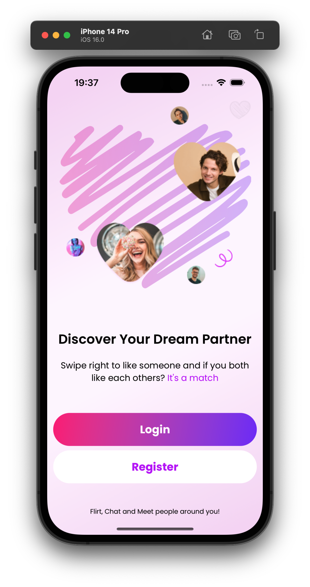

# QuickDate

A example screen for an iOS app ising SwiftUI and Xcode 14.

### How to run:
* Install Xcode 14 on your Mac and double click `quickdate.xcodeproj`.
* Tap Command + R.

Mockup:

Final version:

